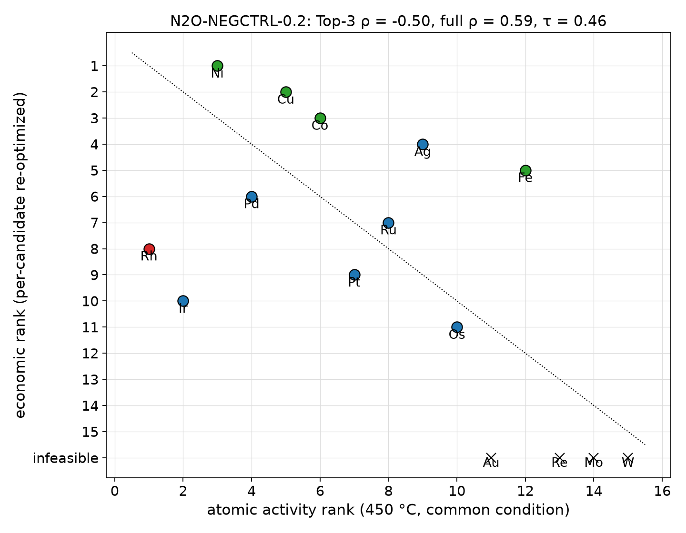
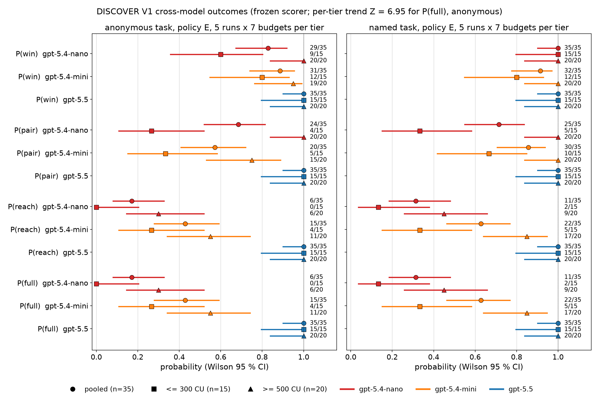

# Catalyst-Essay

**From atomic catalyst ranking to industrial decision-making.**

Catalyst discovery is usually optimized at the atomic scale, while deployment is decided at the system scale. This project asks a different question:

> **How much of an atomic-scale catalyst ranking survives propagation through kinetics, catalyst inventory, reactor operation, recycle/separation and economics — and when does the ranking invert?**

The same framework is then run backward: an industrial cost target is mapped into the catalyst-property improvement required for parity, and the accessible scaling manifold is used to test whether that target is physically reachable.

This repository is a research-facing summary of the current canonical results and the decision-aware AI harness built around them.

## Scientific frame

```text
Forward propagation
DFT / descriptor
    -> scaling + BEP
    -> microkinetics (TOF + coverage)
    -> catalyst productivity / inventory
    -> reactor + process optimization
    -> economics
    -> industrial ranking

Backward design
industrial target
    -> required catalyst-property change
    -> scaling-manifold reachability

Decision-aware AI layer
industrial objective + compute budget
    -> interface-level decisions
    -> tool execution with shared state / provenance
    -> forward + backward evaluation
    -> next-calculation selection
```

The numerical models remain the source of physical and economic results. The AI layer is used where a numerical optimizer cannot decide which mechanism, representation or uncertainty-reduction calculation is worth pursuing.

## Current canonical snapshot

**Canonical ammonia model: `NH3-FINAL-1.1`** (promoted 2026-09-05).

| Result | Current value |
|---|---:|
| Atomic activity top-3 | Ru -> Os -> Fe |
| Economic top-3 | Fe -> Ru -> Os |
| Fe reduced catalyst-dependent cost | **15.292 USD/t NH3** |
| Ru reduced catalyst-dependent cost | **22.031 USD/t NH3** |
| Os reduced catalyst-dependent cost | **25.832 USD/t NH3** |
| Ru / Fe cost ratio | **1.441** |
| Top-3 Spearman rho | **-0.50** |
| Top-3 Kendall tau | **-0.33** |
| Full 15-metal Spearman rho | **0.929** |
| Fe feasibility, 1000-draw MC | **79.9%** |
| Fe Top-3 actionable probability | **94.0%** |
| Ru activity-only break-even target | **201.22x** |
| Scaling-consistent Ru activity headroom, 673 K | **1.090x** |
| Maximum activity headroom over process-state library | **2.525x** |

The central ammonia result is therefore not simply that Fe is cheaper. The **activity ranking reverses at the industrial decision frontier**, while the global 15-metal correlation remains high. The inversion is concentrated among the candidates that actually matter for selection.

The backward-design result is equally important: the Ru activity increase required to reach Fe cost parity is about **201-fold**, whereas the scaling-consistent activity headroom is at most about **2.53-fold** in the current process-state library. Under the frozen model, an activity-only route to parity is therefore unreachable.

## Cross-reaction economic leverage

The same multiscale logic is being tested across reactions rather than assuming a universal inversion mechanism.

For the current CO2-to-methanol benchmark, the local economic leverages are:

| Catalyst-controlled variable | Local leverage |
|---|---:|
| STY | 0.00289 |
| Single-pass conversion | 0.05883 |
| CH4 suppression | **0.37579** |

After aligning the cost denominator, the normalized **MeOH CH4-suppression / NH3 TOF leverage ratio is 273-410**, with a midpoint near **328**. This supports a pathway-specific interpretation: ammonia activity mainly acts through the **activity -> inventory / reactor-demand** pathway, while methanol selectivity acts through **feed loss -> purge / recycle**.

## Negative control: N2O decomposition (rank-preservation test, 2026-09-07)

A pre-registered control reaction was built to test whether the ammonia inversion needs recycle / separation / purge restructuring. Direct N2O decomposition in nitric-acid tail gas is once-through, dilute and conversion-fixed, so catalyst activity enters the economics only through inventory and operating temperature. Same 15 metals, same price basis, per-candidate re-optimization of temperature and bed geometry.

| N2O-NEGCTRL-0.2 (feasible-censored) | value | NH3-FINAL-1.1 |
|---|---:|---:|
| atomic top-3 | Rh > Ir > Ni | Ru > Os > Fe |
| economic top-3 | Ni > Cu > Co | Fe > Ru > Os |
| atomic winner = economic winner | no (Rh -> Ni) | no (Ru -> Fe) |
| Top-3 Spearman rho | **-0.50** | -0.50 |
| full-set Spearman rho / Kendall tau | 0.59 / 0.46 | 0.68 / 0.55 |
| pairwise inversions among feasible pairs | 25 / 55 | 2 / 3 |
| economic winner in 1000 descriptor draws (+/-0.30 eV) | Ni 73 %, Co 17 %, Cu 11 % | — |

**The control fails**: the ranking inverts by the same mechanism as in ammonia. Every precious metal is pushed to the 650 °C bound, where its heating pool alone exceeds the total cost of Ni at 445 °C. With all metals priced equally the full-set correlation rises to 0.97. Recycle restructuring is therefore sufficient but not necessary for a frontier inversion; the necessary condition is an operating variable (pressure in NH3, temperature in N2O) through which an expensive active catalyst can buy down its inventory. Absolute USD/t values are reconstruction-level and not citable process economics.

Report and pre-registration: [`docs/NEGATIVE_CONTROL_V0_1_REPORT.md`](docs/NEGATIVE_CONTROL_V0_1_REPORT.md), [`docs/NEGATIVE_CONTROL_V0_1_PREREGISTRATION.md`](docs/NEGATIVE_CONTROL_V0_1_PREREGISTRATION.md), [`docs/NEGATIVE_CONTROL_V0_2_ADDENDUM.md`](docs/NEGATIVE_CONTROL_V0_2_ADDENDUM.md); figures [`figures/negative_control_n2o/`](figures/negative_control_n2o/).



## Decision-aware DISCOVER benchmark

DISCOVER is a closed-book, budgeted benchmark of scientific decision allocation. The agent receives an anonymous candidate set and can choose among 11 fine-grained scientific actions rather than requesting the entire answer at once.

The V1 protocol was frozen before formal evaluation. The task, prompt, action schema, cost model, scorer, stopping rule and fixed policy-D constants are SHA-pinned; changing any pinned component defines DISCOVER V2. Failures are recorded rather than tuned away.

### Formal strong-tier precursor

The original formal policy-E run used the strong tier and established that the full decision chain was executable under V1:

- `1 CU = 1000` MKM state solves (measured once at about 21.8 ms in the benchmark cost model).
- 70 policy-E runs = 5 runs x 7 budgets x anonymous/named variants.
- Anonymous complete decision: **35/35**.
- Exact break-even recovery: **34/35**.
- 0 infrastructure retries and 0 action errors.

These single-tier results are provenance for the later cross-model test; they are **not** the final general Agent claim.

### Cross-model stability — current Agent result (2026-09-06/07)

The same frozen protocol was evaluated across three capability tiers. Policy E used five independent runs at each of seven budgets (**200, 250, 300, 500, 800, 1200 and 2000 CU**). The two weaker tiers contributed 140 new anonymous/named traces; the strong-tier V1 traces were reused and re-scored, not re-run. Frozen hashes passed before and after the sweep; there were 0 API retries and 0 driver exceptions.

| Anonymous task, pooled over 7 budgets (n = 35 per tier) | gpt-5.4-nano | gpt-5.4-mini | gpt-5.5 |
|---|---:|---:|---:|
| P(winner correct) | 29/35 | 31/35 | 35/35 |
| P(pair decision correct) | 24/35 | 20/35 | 35/35 |
| P(reachability correct) | 6/35 | 15/35 | 35/35 |
| **P(full decision correct)** | **6/35** | **15/35** | **35/35** |
| unnecessary-CU fraction (mean) | 0.46 | 0.30 | 0.19 |

The complete decision requires the chain:

```text
ranking / economic winner
    -> decision-pair selection
    -> backward design
    -> reachability verdict
```

The pooled tier trend in P(full) is strong (**Cochran-Armitage Z = 6.95**). The strong tier executes the complete decision-aware workflow at every tested budget, whereas weaker tiers frequently recover the winner but fail later in pair formation, BACKWARD execution or reachability formulation.

This is the **positive workflow-execution result**: complete decision recovery rises from **6/35 -> 15/35 -> 35/35** as underlying model capability increases.

### Pre-registered E versus fixed-VOI D — negative result

A stronger hypothesis was pre-registered: adaptive policy E should reliably outperform the deterministic fixed-VOI policy D. That hypothesis was **not supported across model tiers**.

- The repeatable adaptive-scope advantage at 200 CU appears only in the strong tier.
- Nano and mini never reproduce the narrow-window strategy (0/140 weak-tier runs versus 7/70 strong-tier runs, all at 200 CU).
- The pre-registered Agent-specific Go criterion — E beats D in at least 4/5 runs at a budget and in at least two model tiers — is **not met**.
- The negative result is retained; no frozen V1 protocol component was changed to make E look better.

The supported conclusion is therefore:

> **A strong model can execute and exploit decision-aware allocation, but adaptive Agent superiority over a fixed-VOI strategy is model-capability dependent rather than universal.**

The negative result rejects only the general claim that **Agent E universally outperforms D**. It does not reject the decision-aware framework itself.

Full report: [`docs/CROSS_MODEL_DISCOVER_V1.md`](docs/CROSS_MODEL_DISCOVER_V1.md); statistics: [`docs/CROSS_MODEL_STATS_V1.md`](docs/CROSS_MODEL_STATS_V1.md); Agent rationale: [`docs/AGENT_HARNESS.md`](docs/AGENT_HARNESS.md); figures: [`figures/discover_cross_model/`](figures/discover_cross_model/).



## Repository map

```text
.
├── README.md
├── STATUS.md
├── docs/
│   ├── RESEARCH_FRAME.md
│   ├── AGENT_HARNESS.md
│   ├── FIGURE_MAP.md
│   ├── MANUSCRIPT_SKELETON.md
│   ├── RESULTS_AT_A_GLANCE.md
│   ├── REFERENCES_STARTER.md
│   ├── CROSS_MODEL_DISCOVER_V1.md
│   └── CROSS_MODEL_STATS_V1.md
├── figures/
│   ├── README.md
│   └── discover_cross_model/        (X1-X9 PNG)
└── data/
    ├── README.md
    ├── canonical_results_2026-09-06.csv
    ├── discover_benchmark_2026-09-06.csv
    ├── cross_model_scores_2026-09-06.csv
    ├── cross_model_failure_matrix_2026-09-06.csv
    ├── cross_model_stats_2026-09-07.csv
    ├── cross_model_metadata_2026-09-06.json
    ├── discover_frozen_v1_hashes.json
    └── cross_model_*.py               (read-only analysis scripts)
```

## Reading guide

For a fast project overview, read [`docs/RESULTS_AT_A_GLANCE.md`](docs/RESULTS_AT_A_GLANCE.md).

For the manuscript storyline, read [`docs/MANUSCRIPT_SKELETON.md`](docs/MANUSCRIPT_SKELETON.md).

For the nine-figure scientific map and current headline values, read [`docs/FIGURE_MAP.md`](docs/FIGURE_MAP.md).

For the AI / agent rationale and benchmark design, read [`docs/AGENT_HARNESS.md`](docs/AGENT_HARNESS.md).

For citation planning, read [`docs/REFERENCES_STARTER.md`](docs/REFERENCES_STARTER.md).

## Current manuscript logic

The project is organized around five linked claims:

1. **Atomic and economic catalyst rankings can diverge at the decision frontier.**
2. **Multiscale uncertainty is not monotonically amplified**; kinetics can amplify energetic uncertainty, while equilibrium, reactor and process bottlenecks can absorb it.
3. **Backward design distinguishes a useful catalyst target from an unreachable one.**
4. **Economic leverage is pathway-specific rather than universal across reactions.**
5. **Decision-aware workflow execution is model-capability dependent; adaptive policy E does not show universal cross-model superiority over fixed-VOI D.**

## Status

The latest frozen scientific model is **NH3-FINAL-1.1**. The current benchmark snapshot is dated **2026-09-07**: DISCOVER V1 formal and cross-model evaluations are complete, with the pre-registered E-vs-D superiority criterion retained as a negative result. The N2O negative-control V0.1/V0.2 study is also complete and is tracked separately from the frozen DISCOVER V1 evidence.

---

*Research snapshot; values in this repository track the current canonical project state rather than the archived NH3-FINAL-1.0 numbers.*
